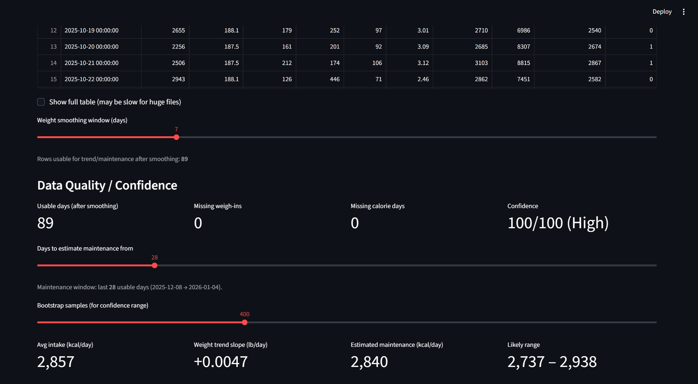
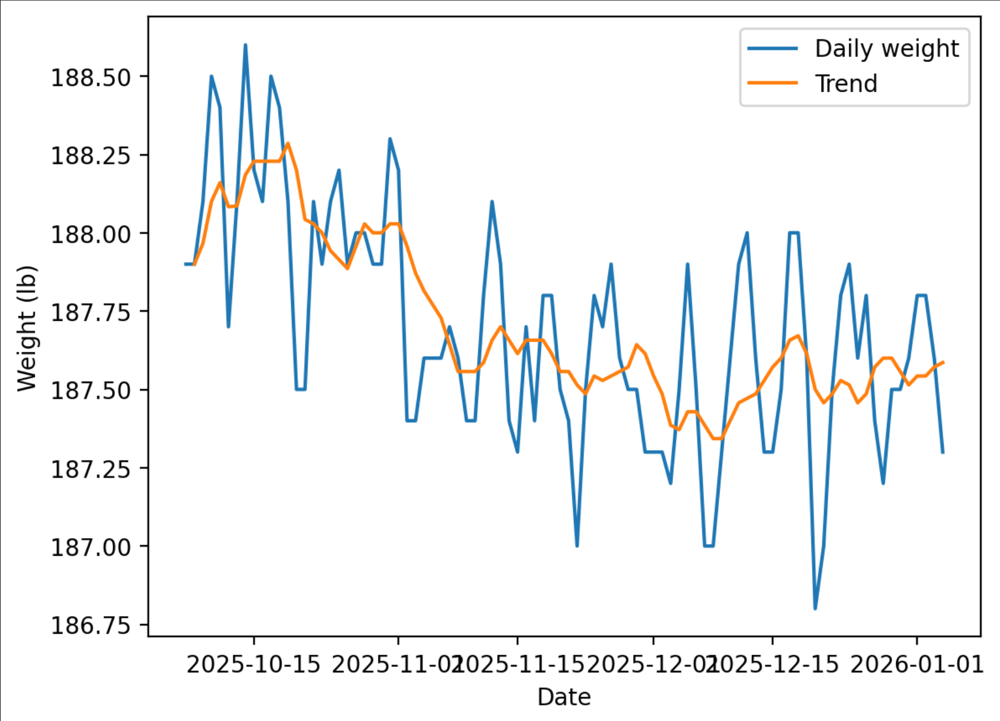
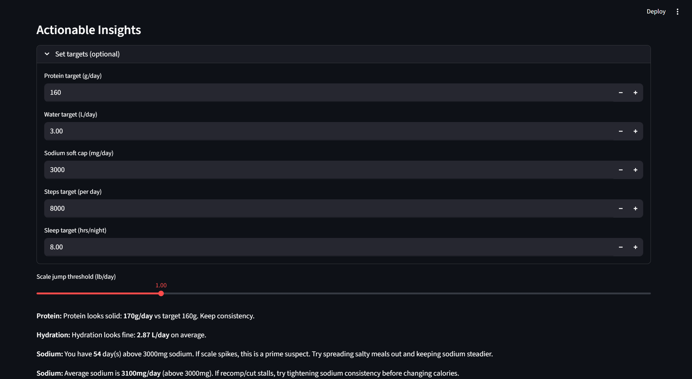
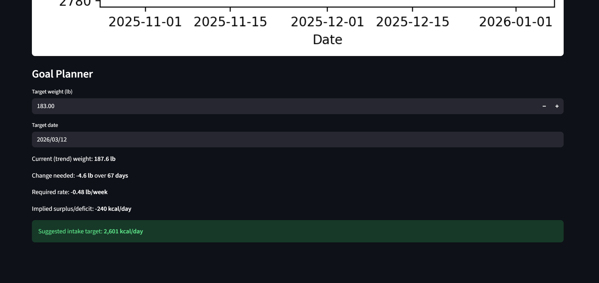

# Maintenance Calories Estimator (Data-Driven)

A data-driven Streamlit app that estimates **maintenance calories (TDEE)** from real weigh-in and intake data, quantifies **confidence**, and generates **actionable nutrition & recovery insights**.  
Designed for lifters doing recomp, maintenance, or controlled bulks/cuts.

---

## Features

### Maintenance Calories (TDEE) Estimation
- Estimates maintenance calories from:
  - average calorie intake
  - **smoothed bodyweight trend slope**
- Uses a physics-based model:
  - TDEE ≈ Avg Intake − (3500 kcal × weight change per day)
- Works even with short datasets, but clearly labels **low-confidence estimates**

### Confidence & Data Quality Scoring
- Automatically scores confidence (0–100) based on:
- number of usable days
- data completeness
- day-to-day weight noise
- Explicit warnings for short or noisy datasets

**Dashboard + Confidence**


---

### Weight Trend Visualization
- Daily weigh-ins with configurable rolling smoothing
- Separates real trend from day-to-day scale noise

**Weight Trend**


---

### Nutrition & Recovery Insights
Automatically analyzes available metrics such as:
- protein, carbs, fat
- water intake
- sodium
- steps
- sleep

Generates **plain-English insights**, for example:
- protein below target
- hydration inconsistency
- sodium-driven scale spikes
- sleep deficits affecting recovery
- logging inconsistencies

📸 **Insights**


---

### Goal Planner
- Enter a target weight and date
- Calculates:
- required rate of change (lb/week)
- implied calorie surplus or deficit
- suggested daily intake
- Includes guardrails for overly aggressive targets

**Goal Planner**


---

## Data Format

The app accepts CSV files with flexible column naming.  
Minimum required columns:
- `date`
- `calories`
- `weight_lb`

Optional columns (auto-detected if present):
- protein, carbs, fat
- sodium
- water
- steps
- sleep
- calories burned / net calories

Column names are normalized automatically (case-insensitive, spaces allowed).

---

## How It Works (Methodology)

1. Smooth bodyweight using a rolling mean
2. Fit a linear trend to recent smoothed weights
3. Convert weight change to energy using **3500 kcal/lb**
4. Adjust average intake to estimate maintenance
5. Bootstrap estimates (when enough data exists) to show a plausible range
6. Score confidence based on dataset size, noise, and completeness

---

## Limitations (By Design)

- **Short datasets (<14 days)** are flagged as *very low confidence*
- Scale weight is affected by water, sodium, and glycogen
- Estimates improve substantially after **21–28 days** of consistent data
- This is not medical advice; it’s a data-driven decision aid

---

## How to Run Locally

```bash
# create & activate virtual environment
python -m venv .venv
.\.venv\Scripts\activate

# install dependencies
pip install -r requirements.txt

# run the app
streamlit run app/streamlit_app.py
```

Then open the local URL Streamlit provides.

---

## Why This Project

This project demonstrates:
- applied data analysis on noisy real-world fitness data
- transparent modeling assumptions
- confidence-aware analytics
- practical decision support for training & nutrition

It intentionally balances statistical rigor with user-understandable outputs.

---

## Future Improvements

- Weekly summaries & deltas
- Outlier detection for weigh-ins
- Lifting volume & progression analysis
- Automatic macro target suggestions
- Deployment on Streamlit Cloud

---
